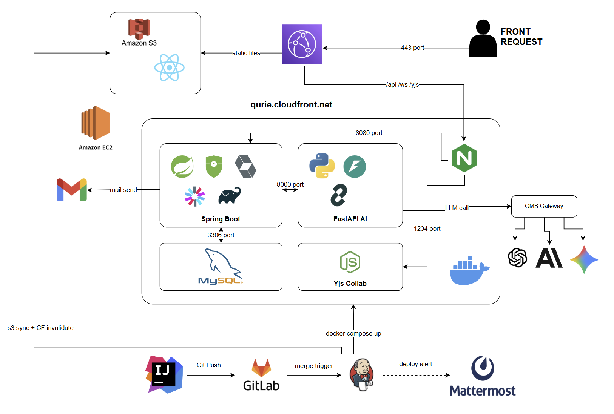

<div align="center">

# Qurie

**AI 기반 실시간 퀴즈 학습 서비스**

작성한 코드를 함께 리뷰하고, 코드 기반 AI 퀴즈로 이해도를 점검하는 학습 플랫폼

`2026.07 ~ 2026.08` · 6인 팀 프로젝트 (SSAFY 15기)

</div>

---

## 왜 만들었나

AI의 발전으로 개발 생산성은 크게 향상됐지만, 코드가 생성되는 속도를 개발자의 이해가 따라가지 못하며 **'인지 부채'** 가 커지고 있습니다. Stack Overflow Developer Survey 2025 기준, 개발자의 84%가 AI를 사용하지만 45%는 AI 생성 코드 디버깅에 오히려 더 많은 시간이 든다고 답했습니다.

Qurie는 학습 과정에서 AI가 작성한 코드를 충분히 이해하지 않은 채 사용하는 습관을 보완하기 위해, **작성한 코드를 함께 리뷰하고 그 코드를 기반으로 한 퀴즈로 이해도를 점검**할 수 있도록 기획했습니다.

## 주요 기능

| 기능 | 설명 |
|---|---|
| 🧑‍💻 **실시간 동시 편집** | Yjs + Monaco 기반 프로젝트 코드 실시간 공동 편집 |
| 📝 **코드 기반 AI 퀴즈** | 코드 스냅샷으로부터 객관식 퀴즈 자동 생성 (Generator → Solver → Judge 파이프라인) 및 즉시 채점 |
| 📊 **학습 리포트** | 개인별 정오답·성취도를 집계·분석해 AI 총평 리포트 제공 |
| 💬 **실시간 채팅·음성** | STOMP 기반 세션 단위 채팅과 음성 채팅 |

## 시스템 아키텍처



### 설계 의사결정

- **STOMP 기반 실시간 세션 설계** — 퀴즈와 채팅을 세션 단위로 구조화해, 여러 스터디가 동시에 진행되어도 각 세션의 데이터와 실시간 메시지가 서로 간섭하지 않도록 격리했습니다.
- **Jenkins 기반 CI/CD 파이프라인** — 빌드·배포를 자동화하고, 배포 후 Health Check를 수행한 뒤 Mattermost로 결과를 알림으로써 배포 성공 여부와 장애 지점을 즉시 파악할 수 있게 했습니다.
- **성능 측정 기반 개선** — k6 부하 테스트로 주요 기능의 병목을 식별하고, 개선 전후를 동일 조건에서 측정해 효과를 수치로 검증했습니다. → [측정 기록](loadtest/RESULTS.md)

## 기술 스택

| 영역 | 스택 |
|---|---|
| Backend | Java, Spring Boot, Spring Security(JWT), JPA, WebSocket/STOMP |
| Collab Server | Node.js, Yjs, y-websocket |
| AI Service | Python, FastAPI (퀴즈 생성 파이프라인) |
| Frontend | React 19, TypeScript, Vite, Monaco Editor, TanStack Query |
| Database | MySQL 8 |
| Infra | AWS EC2, Docker, Jenkins, Nginx, k6 |

## 성능 개선 사례

### 퀴즈 문항 조회 N+1 문제

수강생 30명이 동시에 퀴즈 이력을 조회하는 시나리오(회차당 660건 요청, 3회 반복 측정)에서 응답 시간 증가를 확인 → JPA Lazy Loading으로 문항마다 추가 SELECT가 실행되는 N+1이 원인.

batch fetch size 조정과 Fetch Join을 적용하고, 각 변경의 효과를 동일 조건 부하 테스트로 비교:

| 환경 | 개선 전 | 개선 후 | 효과 |
|---|---|---|---|
| 로컬 평균 응답 | 127.3 ms | 74.9 ms | **-41%** |
| 운영(EC2) 평균 응답 | 365.4 ms | 307.1 ms | **-16%** |

### 채팅 브로드캐스트 한계 탐색

목표 규모(30명 × 2초 간격)에서 p95 40.5ms, 에러 0건. 목표 부하의 약 45배(100명 × 0.5초, 초당 약 2만 건 팬아웃)까지 올려도 p95가 수십 ms로 유지되어 채팅 경로는 개선 대상에서 제외 — 알려진 구조적 한계는 인메모리 SimpleBroker의 단일 인스턴스 제약임을 문서화.

## 트러블슈팅

<details>
<summary><b>Jenkins 컨테이너와 EC2 Host 간 UID 불일치</b></summary>

**문제** — 배포 과정에서 Git 권한 오류로 Jenkins 파이프라인이 중단되고, 이후 EC2에서도 `git pull`이 실패.

**원인** — Jenkins 컨테이너의 root(UID 0)와 EC2 ubuntu(UID 1000)가 같은 Git 디렉터리를 서로 다른 소유권 상태로 수정하면서 권한 충돌 발생.

**해결** — ① `safe.directory` 등록으로 Jenkins의 Git 작업을 우선 정상화 → ② Jenkins 실행 UID를 host와 동일한 1000으로 통일해 충돌을 구조적으로 제거.

**배운 점** — 컨테이너와 호스트가 디렉터리를 공유할 때는 실행 사용자의 UID와 파일 소유권 관계까지 고려해야 한다. 일정이 촉박할 때는 서비스 정상화 조치를 먼저 적용하고, 이후 구조 개선으로 우선순위를 나누는 것이 중요하다.

</details>

<details>
<summary><b>퀴즈 문항 조회 N+1 문제</b></summary>

**문제** — 30명 동시 조회 부하 테스트에서 퀴즈 조회 API 응답 시간 증가.

**원인** — JPA Lazy Loading으로 문항마다 추가 SELECT 쿼리가 실행되는 N+1 문제.

**해결** — batch fetch size 조정 + Fetch Join 적용. 변경마다 동일 조건 부하 테스트로 효과를 비교해 운영 환경 응답 시간 약 16% 단축.

**배운 점** — 코드만으로 성능을 판단하기보다 실제 실행되는 쿼리 횟수를 함께 확인해야 하며, 개선 효과는 동일 조건에서 전후를 측정해 수치로 검증해야 한다.

</details>

## 프로젝트 구조

```
├── backend/          # Spring Boot API 서버
├── frontend/         # React + Vite 클라이언트
├── collab-server/    # Yjs 실시간 동시 편집 동기화 서버
├── ai_service/       # FastAPI 퀴즈 생성 파이프라인
├── loadtest/         # k6 부하 테스트 시나리오 및 측정 기록
├── jenkins/          # CI/CD 설정
└── docs/             # 설계 문서 (API 명세, ERD 등)
```

## 담당 역할 (김태수 — Backend · Infra)

- 세션·그룹 등 핵심 도메인 REST API 구현
- STOMP 기반 실시간 채팅·음성 채팅 구현
- Jenkins CI/CD 파이프라인 및 Docker 배포 환경 구축 (배포 후 Health Check → Mattermost 알림)
- k6 부하 테스트 설계·실행 및 JPA N+1 개선
- API 명세서 작성 및 ERD 설계, Jira 기반 일정 관리
