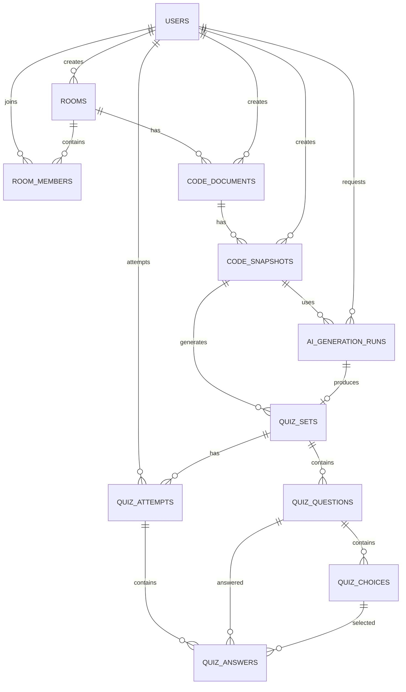
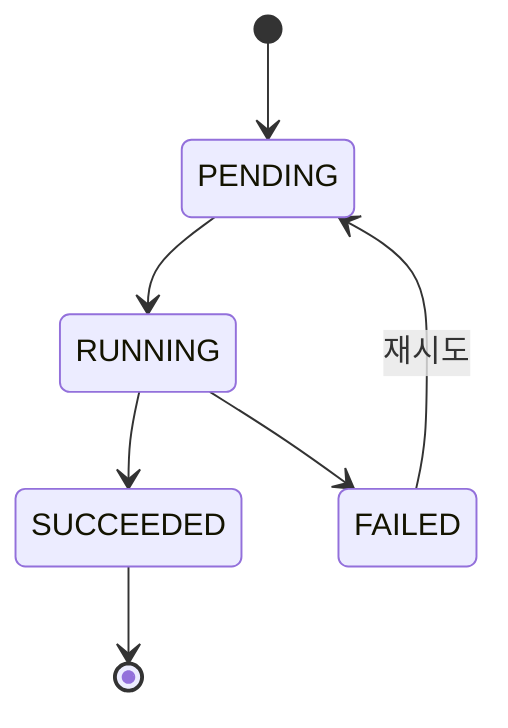
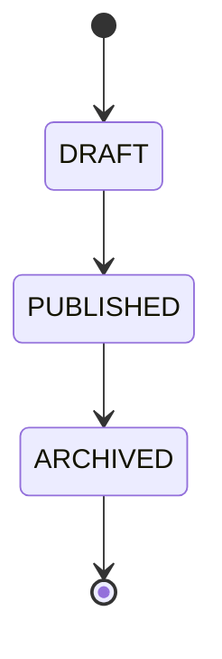
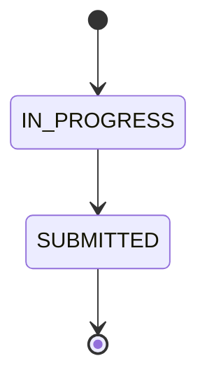

# Day 1 — 도메인 분석·ERD·API 설계

## 1. 학습 목표

Qurie 서비스의 요구사항을 분석하여 핵심 도메인을 구분하고, 이를 바탕으로 ERD와 API를 설계했다.

이번 학습의 주요 목표는 다음과 같다.

* 요구사항에서 명사와 행위를 분리한다.
* 엔티티와 API DTO의 차이를 이해한다.
* 방 소유자와 참여자의 권한을 구분한다.
* 코드 작성부터 AI 퀴즈 생성, 제출까지의 상태 변화를 정리한다.
* 엔티티 간 관계를 기반으로 데이터베이스 구조를 설계한다.

---

## 2. 서비스 핵심 흐름

Qurie의 핵심 흐름을 다음과 같이 정리했다.

```text
사용자가 방을 생성하거나 참여한다.
        ↓
방 참여자들이 코드 문서를 작성하고 수정한다.
        ↓
특정 시점의 코드를 스냅샷으로 저장한다.
        ↓
스냅샷을 기준으로 AI 퀴즈 생성을 요청한다.
        ↓
AI가 문제와 선택지를 생성한다.
        ↓
방 소유자가 퀴즈를 검토하고 공개한다.
        ↓
방 참여자가 퀴즈를 풀고 제출한다.
        ↓
서버가 답안을 채점하고 결과를 저장한다.
```

현재 수정 중인 코드가 아니라 `CodeSnapshot`을 기준으로 퀴즈를 생성해야 한다는 점이 중요하다.

퀴즈 생성 중에도 코드 문서는 계속 수정될 수 있기 때문에, `CodeDocument`를 직접 퀴즈와 연결하면 어떤 코드 버전을 기준으로 문제가 만들어졌는지 알기 어려워진다.

따라서 다음 구조로 설계했다.

```text
CodeDocument
    ↓
CodeSnapshot
    ↓
QuizSet
```

---

## 3. 요구사항에서 명사와 행위 분리

요구사항을 분석할 때 명사는 엔티티 후보가 되고, 행위는 API 후보가 된다.

예시 요구사항은 다음과 같다.

> 방 소유자는 코드 스냅샷을 기반으로 AI 퀴즈 생성을 요청할 수 있다. 방 참여자는 공개된 퀴즈를 풀고 제출할 수 있다.

### 3.1 명사

* 사용자
* 방
* 방 소유자
* 방 참여자
* 코드 문서
* 코드 스냅샷
* 퀴즈
* 문제
* 선택지
* 퀴즈 응시
* 답변
* AI 생성 작업

### 3.2 행위

* 방을 생성한다.
* 방에 참여한다.
* 방 정보를 수정한다.
* 코드를 작성한다.
* 코드를 수정한다.
* 코드 스냅샷을 생성한다.
* AI 퀴즈 생성을 요청한다.
* 퀴즈 생성 상태를 확인한다.
* 퀴즈를 공개한다.
* 퀴즈 응시를 시작한다.
* 답변을 저장한다.
* 퀴즈를 제출한다.
* 퀴즈 결과를 확인한다.

### 3.3 명사와 테이블 연결

| 요구사항의 명사 | 테이블                  |
| -------- | -------------------- |
| 사용자      | `users`              |
| 방        | `rooms`              |
| 방 참여자    | `room_members`       |
| 코드 문서    | `code_documents`     |
| 코드 스냅샷   | `code_snapshots`     |
| 퀴즈 묶음    | `quiz_sets`          |
| 퀴즈 문제    | `quiz_questions`     |
| 문제 선택지   | `quiz_choices`       |
| 퀴즈 응시    | `quiz_attempts`      |
| 문제별 답변   | `quiz_answers`       |
| AI 생성 작업 | `ai_generation_runs` |

---

## 4. 엔티티와 DTO의 차이

### 4.1 엔티티

엔티티는 데이터베이스 테이블과 대응되며, 서비스 내부의 데이터를 표현한다.

엔티티는 다음과 같은 책임을 가진다.

* 데이터베이스 상태 표현
* 엔티티 간 연관관계 표현
* 도메인 규칙 수행
* 데이터 저장과 변경 관리

예시는 다음과 같다.

```java
@Entity
public class Room {

    @Id
    @GeneratedValue(strategy = GenerationType.IDENTITY)
    private Long id;

    private String name;

    private String description;

    @Enumerated(EnumType.STRING)
    private RoomStatus status;
}
```

### 4.2 DTO

DTO는 API 요청과 응답에 필요한 데이터만 전달하는 객체이다.

```java
public record CreateRoomRequest(
    String name,
    String description
) {
}
```

```java
public record RoomResponse(
    Long roomId,
    String name,
    String description,
    String myRole,
    int memberCount
) {
}
```

### 4.3 엔티티와 DTO를 분리하는 이유

* 데이터베이스 구조가 외부에 그대로 노출되는 것을 방지할 수 있다.
* 비밀번호, 정답 여부 등 민감한 데이터를 숨길 수 있다.
* 화면에 필요한 형태로 데이터를 조합할 수 있다.
* 엔티티 구조가 변경되더라도 API 응답 구조를 유지할 수 있다.
* API별로 필요한 데이터만 전달할 수 있다.

특히 퀴즈 문제를 조회할 때 엔티티를 그대로 반환하면 안 된다.

```java
public class QuizChoice {
    private String content;
    private boolean isCorrect;
}
```

퀴즈 제출 전에 `isCorrect`가 응답에 포함되면 브라우저 개발자 도구를 통해 정답을 확인할 수 있다.

따라서 퀴즈 응시용 DTO에서는 정답 정보를 제외해야 한다.

```java
public record QuizChoiceResponse(
    Long choiceId,
    String content
) {
}
```

---

## 5. ERD



---

## 6. 엔티티별 책임

### 6.1 `users`

사용자의 계정 정보를 관리한다.

주요 필드는 다음과 같다.

```text
id
email
password_hash
nickname
created_at
updated_at
```

주요 책임은 다음과 같다.

* 사용자 로그인 및 식별
* 방 생성 및 참여 주체 표현
* 코드 작성자와 스냅샷 생성자 표현
* 퀴즈 응시자 표현
* AI 퀴즈 생성 요청자 표현

---

### 6.2 `rooms`

사용자가 협업하는 공간을 관리한다.

```text
id
name
description
invite_code
status
created_by
created_at
updated_at
```

방 상태는 다음과 같이 구성할 수 있다.

```text
ACTIVE
CLOSED
```

주요 책임은 다음과 같다.

* 협업 공간 정보 관리
* 초대 코드 관리
* 코드 문서와 참여자 관리 기준 제공
* 활성화 및 종료 상태 관리

`created_by`는 방을 최초로 생성한 사용자를 기록하는 용도로 사용한다.

실제 현재 권한은 `room_members.role`을 기준으로 판단하는 것이 적절하다.

---

### 6.3 `room_members`

사용자와 방 사이의 다대다 관계를 관리한다.

```text
id
room_id
user_id
role
joined_at
```

역할은 다음과 같이 구분한다.

```text
OWNER
MEMBER
```

중복 참여를 막기 위해 다음 제약조건이 필요하다.

```text
UNIQUE(room_id, user_id)
```

주요 책임은 다음과 같다.

* 사용자의 방 참여 여부 관리
* 방 안에서의 사용자 권한 관리
* 참여 시점 기록

---

### 6.4 `code_documents`

방에서 현재 편집 중인 코드 문서를 관리한다.

```text
id
room_id
title
language
content
version
created_by
created_at
updated_at
```

주요 책임은 다음과 같다.

* 현재 코드 내용 관리
* 프로그래밍 언어 정보 관리
* 코드의 최신 버전 관리
* 동시 수정 충돌 감지

`version` 필드를 사용하면 사용자가 오래된 코드를 기준으로 저장하는 상황을 감지할 수 있다.

```text
서버의 현재 버전: 10
클라이언트 요청 버전: 9
결과: 버전 충돌
```

실시간 편집은 Yjs나 CRDT 같은 기술로 처리할 수 있고, 데이터베이스에는 최종 코드 상태와 버전을 저장할 수 있다.

---

### 6.5 `code_snapshots`

특정 시점의 코드를 변경되지 않는 상태로 저장한다.

```text
id
code_document_id
content
version
created_by
created_at
```

주요 책임은 다음과 같다.

* AI 퀴즈 생성 기준 코드 제공
* 코드 변경 이력 관리
* 이전 코드 복원 기준 제공
* 퀴즈가 어떤 코드를 기준으로 생성되었는지 추적

스냅샷은 생성된 이후 수정하지 않는 불변 데이터로 관리하는 것이 적절하다.

---

### 6.6 `quiz_sets`

하나의 코드 스냅샷을 기준으로 생성된 퀴즈 묶음을 관리한다.

```text
id
code_snapshot_id
title
status
created_at
published_at
```

퀴즈 상태는 다음과 같이 구분한다.

```text
DRAFT
PUBLISHED
ARCHIVED
```

각 상태의 의미는 다음과 같다.

* `DRAFT`: AI가 생성했지만 아직 참여자에게 공개되지 않은 상태
* `PUBLISHED`: 방 참여자가 응시할 수 있는 상태
* `ARCHIVED`: 신규 응시가 종료된 상태

---

### 6.7 `quiz_questions`

퀴즈에 포함되는 개별 문제를 관리한다.

```text
id
quiz_set_id
question_type
content
explanation
order_index
```

문제 유형은 다음과 같이 구성할 수 있다.

```text
MULTIPLE_CHOICE
TRUE_FALSE
SHORT_ANSWER
```

초기 MVP에서는 구현 범위를 줄이기 위해 객관식 문제만 지원하는 것이 적절하다고 판단했다.

---

### 6.8 `quiz_choices`

객관식 문제의 선택지를 관리한다.

```text
id
quiz_question_id
content
is_correct
order_index
```

주요 책임은 다음과 같다.

* 선택지 내용 저장
* 선택지 출력 순서 관리
* 정답 선택지 관리

`is_correct` 필드는 퀴즈 제출 전 응답 DTO에 포함하면 안 된다.

---

### 6.9 `quiz_attempts`

한 사용자가 특정 퀴즈에 응시한 기록을 관리한다.

```text
id
quiz_set_id
user_id
status
score
started_at
submitted_at
```

응시 상태는 다음과 같이 구성한다.

```text
IN_PROGRESS
SUBMITTED
```

주요 책임은 다음과 같다.

* 퀴즈 응시 시작 시점 관리
* 제출 여부 관리
* 최종 점수 관리
* 특정 사용자의 응시 기록 관리

주관식 채점 기능이 추가되면 다음 상태를 추가할 수 있다.

```text
GRADED
```

---

### 6.10 `quiz_answers`

한 번의 퀴즈 응시에서 문제별 답변을 관리한다.

```text
id
quiz_attempt_id
quiz_question_id
selected_choice_id
text_answer
is_correct
answered_at
```

한 응시에서 같은 문제의 답변이 중복 생성되는 것을 막기 위해 다음 제약조건이 필요하다.

```text
UNIQUE(quiz_attempt_id, quiz_question_id)
```

초기 객관식 MVP에서는 `selected_choice_id`를 중심으로 사용한다.

---

### 6.11 `ai_generation_runs`

AI 퀴즈 생성 요청과 실행 결과를 관리한다.

```text
id
code_snapshot_id
requested_by
status
model_name
prompt
error_message
started_at
completed_at
created_at
```

AI 생성 상태는 다음과 같이 구분한다.

```text
PENDING
RUNNING
SUCCEEDED
FAILED
```

주요 책임은 다음과 같다.

* AI 요청 상태 추적
* 사용한 모델 기록
* 생성에 사용된 프롬프트 기록
* 실행 시간 기록
* 실패 원인 기록
* 실패한 작업의 재시도 기준 제공

AI 생성 상태를 `quiz_sets`에 직접 포함하는 것보다 실행 작업을 별도 엔티티로 분리하면 실패 처리와 재시도 관리가 쉬워진다.

---

## 7. 상태 변화

### 7.1 AI 퀴즈 생성 상태



처리 흐름은 다음과 같다.

```text
코드 스냅샷 생성
        ↓
AI 생성 요청 등록
        ↓
PENDING
        ↓
RUNNING
       ↙       ↘
SUCCEEDED     FAILED
    ↓
QuizSet 생성
    ↓
DRAFT
```

---

### 7.2 퀴즈 공개 상태



* AI가 퀴즈 생성을 완료하면 `DRAFT` 상태로 저장한다.
* 방 소유자가 내용을 검토한 후 `PUBLISHED` 상태로 변경한다.
* 퀴즈 운영이 끝나면 `ARCHIVED` 상태로 변경한다.

---

### 7.3 퀴즈 응시 상태



퀴즈 응시 과정은 다음과 같다.

```text
퀴즈 응시 시작
        ↓
IN_PROGRESS
        ↓
문제별 답변 저장 및 수정
        ↓
퀴즈 제출
        ↓
서버에서 채점
        ↓
SUBMITTED
```

`SUBMITTED` 상태가 되면 답변을 수정할 수 없도록 해야 한다.

점수는 클라이언트가 계산해서 보내는 것이 아니라 서버가 저장된 정답을 기준으로 계산해야 한다.

---

## 8. API 목록

### 8.1 방 API

| Method   | URL                                    | 설명             | 권한      |
| -------- | -------------------------------------- | -------------- | ------- |
| `POST`   | `/api/rooms`                           | 방 생성           | 로그인 사용자 |
| `GET`    | `/api/rooms`                           | 내가 참여한 방 목록 조회 | 로그인 사용자 |
| `GET`    | `/api/rooms/{roomId}`                  | 방 상세 조회        | 방 참여자   |
| `PATCH`  | `/api/rooms/{roomId}`                  | 방 정보 수정        | OWNER   |
| `DELETE` | `/api/rooms/{roomId}`                  | 방 종료           | OWNER   |
| `POST`   | `/api/rooms/{roomId}/join`             | 초대 코드를 통한 방 참여 | 로그인 사용자 |
| `POST`   | `/api/rooms/{roomId}/leave`            | 방 나가기          | MEMBER  |
| `GET`    | `/api/rooms/{roomId}/members`          | 방 참여자 조회       | 방 참여자   |
| `DELETE` | `/api/rooms/{roomId}/members/{userId}` | 참여자 강퇴         | OWNER   |

방 삭제는 데이터를 바로 삭제하는 방식보다 `CLOSED` 상태로 변경하는 소프트 삭제 방식이 안전하다.

---

### 8.2 코드 문서 API

| Method   | URL                                          | 설명             | 권한           |
| -------- | -------------------------------------------- | -------------- | ------------ |
| `POST`   | `/api/rooms/{roomId}/code-documents`         | 코드 문서 생성       | 방 참여자        |
| `GET`    | `/api/rooms/{roomId}/code-documents`         | 방의 코드 문서 목록 조회 | 방 참여자        |
| `GET`    | `/api/code-documents/{documentId}`           | 코드 문서 상세 조회    | 방 참여자        |
| `PATCH`  | `/api/code-documents/{documentId}`           | 코드 문서 수정       | 방 참여자        |
| `DELETE` | `/api/code-documents/{documentId}`           | 코드 문서 삭제       | OWNER 또는 작성자 |
| `POST`   | `/api/code-documents/{documentId}/snapshots` | 코드 스냅샷 생성      | 방 참여자        |
| `GET`    | `/api/code-documents/{documentId}/snapshots` | 스냅샷 목록 조회      | 방 참여자        |
| `GET`    | `/api/code-snapshots/{snapshotId}`           | 스냅샷 상세 조회      | 방 참여자        |

---

### 8.3 AI 퀴즈 생성 API

| Method | URL                                                 | 설명            | 권한    |
| ------ | --------------------------------------------------- | ------------- | ----- |
| `POST` | `/api/code-snapshots/{snapshotId}/quiz-generations` | AI 퀴즈 생성 요청   | OWNER |
| `GET`  | `/api/ai-generation-runs/{runId}`                   | AI 생성 상태 조회   | 방 참여자 |
| `POST` | `/api/ai-generation-runs/{runId}/retry`             | 실패한 AI 생성 재시도 | OWNER |

---

### 8.4 퀴즈 관리 API

| Method   | URL                                  | 설명          | 권한    |
| -------- | ------------------------------------ | ----------- | ----- |
| `GET`    | `/api/rooms/{roomId}/quiz-sets`      | 방의 퀴즈 목록 조회 | 방 참여자 |
| `GET`    | `/api/quiz-sets/{quizSetId}`         | 퀴즈 상세 조회    | 방 참여자 |
| `PATCH`  | `/api/quiz-sets/{quizSetId}`         | 퀴즈 제목 수정    | OWNER |
| `PATCH`  | `/api/quiz-questions/{questionId}`   | 퀴즈 문제 수정    | OWNER |
| `POST`   | `/api/quiz-sets/{quizSetId}/publish` | 퀴즈 공개       | OWNER |
| `POST`   | `/api/quiz-sets/{quizSetId}/archive` | 퀴즈 종료       | OWNER |
| `DELETE` | `/api/quiz-sets/{quizSetId}`         | 퀴즈 삭제       | OWNER |

---

### 8.5 퀴즈 응시 API

| Method | URL                                                   | 설명             | 권한     |
| ------ | ----------------------------------------------------- | -------------- | ------ |
| `POST` | `/api/quiz-sets/{quizSetId}/attempts`                 | 퀴즈 응시 시작       | 방 참여자  |
| `GET`  | `/api/quiz-attempts/{attemptId}`                      | 응시 상태 조회       | 응시자 본인 |
| `PUT`  | `/api/quiz-attempts/{attemptId}/answers/{questionId}` | 문제 답변 저장 및 수정  | 응시자 본인 |
| `POST` | `/api/quiz-attempts/{attemptId}/submit`               | 퀴즈 제출          | 응시자 본인 |
| `GET`  | `/api/quiz-attempts/{attemptId}/result`               | 자신의 퀴즈 결과 조회   | 응시자 본인 |
| `GET`  | `/api/quiz-sets/{quizSetId}/results`                  | 퀴즈 전체 응시 결과 조회 | OWNER  |

---

## 9. OWNER와 MEMBER 권한표

| 기능           |    OWNER   | MEMBER |
| ------------ | :--------: | :----: |
| 방 정보 조회      |      O     |    O   |
| 방 정보 수정      |      O     |    X   |
| 방 종료         |      O     |    X   |
| 참여자 목록 조회    |      O     |    O   |
| 참여자 강퇴       |      O     |    X   |
| 방 나가기        | 권한 양도 후 가능 |    O   |
| 코드 문서 생성     |      O     |    O   |
| 코드 문서 조회     |      O     |    O   |
| 코드 문서 수정     |      O     |    O   |
| 코드 스냅샷 생성    |      O     |    O   |
| 코드 문서 삭제     |      O     |   제한적  |
| AI 퀴즈 생성 요청  |      O     |    X   |
| AI 생성 상태 조회  |      O     |    O   |
| 퀴즈 초안 수정     |      O     |    X   |
| 퀴즈 공개        |      O     |    X   |
| 퀴즈 종료        |      O     |    X   |
| 퀴즈 응시        |      O     |    O   |
| 자신의 결과 조회    |      O     |    O   |
| 전체 참여자 결과 조회 |      O     |    X   |

OWNER가 방을 나가기 위해서는 다음 조건이 필요하다.

```text
다른 MEMBER에게 OWNER 권한을 양도한 후 방에서 나갈 수 있다.
```

방에 참여자가 없거나 권한을 양도하지 않은 경우에는 방을 종료하도록 처리한다.

---

## 10. 권한 검증 방식

단순히 URL의 리소스 ID를 알고 있다고 해서 접근을 허용하면 안 된다.

예를 들어 사용자가 다음 URL을 임의로 변경할 수 있다.

```text
/api/code-documents/100
/api/quiz-attempts/200
```

따라서 서버에서는 다음 순서로 권한을 검증해야 한다.

```text
현재 로그인한 사용자 확인
        ↓
조회하려는 리소스가 속한 방 확인
        ↓
사용자가 해당 방에 참여하고 있는지 확인
        ↓
해당 기능에 필요한 역할이 있는지 확인
```

서비스 계층에 공통 권한 검증 로직을 분리할 수 있다.

```java
public RoomMember getRoomMember(Long roomId, Long userId) {
    return roomMemberRepository
        .findByRoomIdAndUserId(roomId, userId)
        .orElseThrow(() ->
            new ForbiddenException("방 참여자가 아닙니다.")
        );
}
```

```java
public void validateOwner(Long roomId, Long userId) {
    RoomMember roomMember = getRoomMember(roomId, userId);

    if (roomMember.getRole() != RoomRole.OWNER) {
        throw new ForbiddenException(
            "방 소유자만 수행할 수 있습니다."
        );
    }
}
```

퀴즈 응시 기록은 방 권한뿐만 아니라 실제 응시자 본인인지도 검증해야 한다.

```java
if (!quizAttempt.isOwner(currentUserId)) {
    throw new ForbiddenException(
        "본인의 퀴즈 응시 기록만 조회할 수 있습니다."
    );
}
```

---

## 11. 주요 API 실패 상황

### 11.1 방 생성

```text
POST /api/rooms
```

실패 상황은 다음과 같다.

* 사용자가 로그인하지 않음
* 방 이름이 비어 있음
* 방 이름의 길이가 제한을 초과함

---

### 11.2 방 참여

```text
POST /api/rooms/{roomId}/join
```

실패 상황은 다음과 같다.

* 존재하지 않는 방
* 종료된 방
* 잘못된 초대 코드
* 이미 참여 중인 사용자

---

### 11.3 코드 스냅샷 생성

```text
POST /api/code-documents/{documentId}/snapshots
```

실패 상황은 다음과 같다.

* 존재하지 않는 코드 문서
* 사용자가 해당 방의 참여자가 아님
* 코드 내용이 비어 있음
* 클라이언트 버전과 서버 버전이 일치하지 않음

---

### 11.4 AI 퀴즈 생성

```text
POST /api/code-snapshots/{snapshotId}/quiz-generations
```

실패 상황은 다음과 같다.

* 존재하지 않는 스냅샷
* 사용자가 OWNER가 아님
* 동일 스냅샷에 대해 AI 생성이 이미 진행 중임
* AI 서비스 호출 실패
* AI 응답 형식이 올바르지 않음

---

### 11.5 퀴즈 응시 시작

```text
POST /api/quiz-sets/{quizSetId}/attempts
```

실패 상황은 다음과 같다.

* 존재하지 않는 퀴즈
* 사용자가 해당 방의 참여자가 아님
* 퀴즈 상태가 `PUBLISHED`가 아님
* 이미 해당 퀴즈에 응시함
* 퀴즈가 `ARCHIVED` 상태임

---

### 11.6 퀴즈 제출

```text
POST /api/quiz-attempts/{attemptId}/submit
```

실패 상황은 다음과 같다.

* 존재하지 않는 응시 기록
* 본인의 응시 기록이 아님
* 이미 제출한 응시 기록
* 필수 문제에 답하지 않음
* 퀴즈가 종료됨

---

## 12. MVP 정책

초기 MVP에서는 다음과 같은 정책을 적용하기로 했다.

```text
방마다 OWNER는 한 명만 존재한다.
모든 방 참여자는 코드를 편집할 수 있다.
모든 방 참여자는 코드 스냅샷을 생성할 수 있다.
AI 퀴즈 생성은 OWNER만 요청할 수 있다.
AI가 생성한 퀴즈는 DRAFT 상태로 저장한다.
OWNER가 검토한 후 퀴즈를 공개한다.
문제 유형은 객관식만 지원한다.
한 사용자는 하나의 퀴즈에 한 번만 응시할 수 있다.
퀴즈 제출 전에는 답변을 수정할 수 있다.
퀴즈 제출 후에는 답변을 수정할 수 없다.
점수는 서버에서 계산한다.
OWNER는 전체 참여자의 결과를 조회할 수 있다.
MEMBER는 자신의 결과만 조회할 수 있다.
```

---

## 13. 설계하면서 중요하다고 느낀 점

### 13.1 코드 문서와 스냅샷은 분리해야 한다

`CodeDocument`는 계속 변경되는 현재 상태이고, `CodeSnapshot`은 특정 시점의 변경되지 않는 상태이다.

AI 퀴즈는 재현 가능해야 하므로 반드시 스냅샷을 기준으로 생성해야 한다.

---

### 13.2 생성 작업과 생성 결과를 분리해야 한다

`AiGenerationRun`은 AI 호출 과정과 상태를 관리하고, `QuizSet`은 성공적으로 생성된 퀴즈 결과를 관리한다.

두 엔티티를 분리하면 다음 기능을 구현하기 쉬워진다.

* 실패 원인 기록
* AI 생성 재시도
* 모델별 생성 결과 비교
* 생성 시간 측정
* 운영 중 오류 추적

---

### 13.3 퀴즈와 응시 기록은 분리해야 한다

`QuizSet`은 모든 사용자가 공유하는 문제이고, `QuizAttempt`는 각 사용자의 개별 응시 기록이다.

한 퀴즈에 여러 사용자가 응시할 수 있으므로 다음 관계가 된다.

```text
QuizSet 1 : N QuizAttempt
```

---

### 13.4 정답은 제출 전에 노출하면 안 된다

데이터베이스에 저장된 `is_correct`, `correct_choice_id`, `explanation` 등의 값은 퀴즈 응시용 API 응답에 포함하면 안 된다.

제출 전 DTO와 제출 후 결과 DTO를 분리해야 한다.

```text
QuizQuestionForAttemptResponse
QuizQuestionResultResponse
```

---

### 13.5 권한은 프론트엔드가 아니라 서버에서 검증해야 한다

프론트엔드에서 버튼을 숨기는 것은 사용자 경험을 위한 처리일 뿐 보안 처리가 아니다.

사용자는 직접 API를 호출할 수 있으므로 모든 권한 검증은 서버에서 다시 수행해야 한다.

---

## 14. 추가로 결정해야 할 사항

다음 내용은 팀원들과 추가 논의가 필요하다.

* 하나의 방에 코드 문서를 몇 개까지 만들 수 있는가
* 코드 문서 삭제를 작성자에게도 허용할 것인가
* 스냅샷을 사용자가 직접 생성할 것인가
* 일정 시간마다 자동으로 스냅샷을 생성할 것인가
* 하나의 스냅샷에서 여러 퀴즈를 생성할 수 있는가
* AI 생성 실패 시 자동 재시도를 지원할 것인가
* 퀴즈 제출 후 정답과 해설을 바로 공개할 것인가
* OWNER도 퀴즈에 응시할 수 있는가
* 방에서 나간 사용자의 응시 기록을 유지할 것인가
* 객관식 문제에 복수 정답을 허용할 것인가
* 퀴즈 공개 후에도 문제를 수정할 수 있는가

---

## 15. 오늘 학습한 내용 요약

오늘은 Qurie 서비스의 요구사항을 분석하여 엔티티와 행위를 구분하고, 이를 데이터베이스 테이블과 API로 연결했다.

특히 다음 내용을 이해했다.

1. 요구사항의 명사는 엔티티 후보가 되고 행위는 API 후보가 된다.
2. 엔티티는 데이터베이스 상태를 표현하고 DTO는 API에 필요한 데이터를 전달한다.
3. 현재 코드와 AI 생성 기준 코드를 분리하기 위해 코드 스냅샷이 필요하다.
4. AI 생성 작업과 퀴즈 결과는 서로 다른 생명주기를 가지므로 분리해야 한다.
5. 퀴즈 문제와 사용자별 응시 기록을 분리해야 한다.
6. 퀴즈 제출 전에는 정답과 해설이 API에 노출되지 않도록 해야 한다.
7. OWNER와 MEMBER의 권한을 기능별로 명확하게 구분해야 한다.
8. 리소스 접근 권한은 프론트엔드가 아닌 서버에서 검증해야 한다.
9. 퀴즈 생성, 공개, 응시는 각각 상태값을 통해 관리해야 한다.
10. 서버는 클라이언트가 전달한 점수가 아닌 저장된 정답을 기준으로 직접 채점해야 한다.

--- 

## 16. Day 1 완료 항목

* [x] 요구사항에서 명사와 행위 분리
* [x] 엔티티와 DTO의 차이 정리
* [x] 주요 엔티티 관계 정의
* [x] ERD 작성
* [x] 엔티티별 책임 정리
* [x] API 목록 작성
* [x] OWNER와 MEMBER 권한표 작성
* [x] AI 생성 상태 변화 정리
* [x] 퀴즈 공개 상태 변화 정리
* [x] 퀴즈 응시 상태 변화 정리
* [x] 주요 실패 상황 정리
* [x] 초기 MVP 정책 결정
* [ ] 실제 데이터베이스 컬럼 타입 결정
* [ ] 인덱스 및 제약조건 구체화
* [ ] API 요청 및 응답 DTO 상세 설계
* [ ] Spring Boot 엔티티 구현
