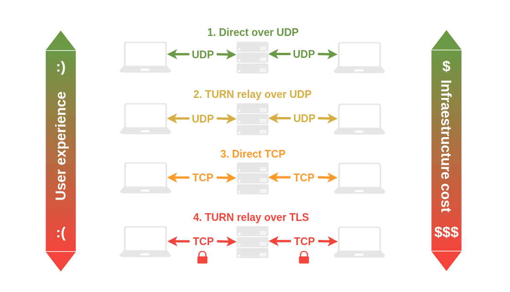

# WebRTC의 기본 (7/13) - 복습 및 심화 해설 노트

* P2P(중간 서버를 거치지 않는 클라이언트 간 직접 연결)를 이용하는 웹 통신 기술.
* 영상/음성 데이터는 P2P로 직통으로 쏘지만, 처음에 서로의 IP와 포트를 교환하는 **Signaling** 단계가 반드시 필요하다. 이 시그널링 서버를 구축하기 위해 실시간 양방향 통신인 웹소켓을 뼈대로 깔고 가는 것이다.

---

## 미리 알아야 할 개념

* **TCP(Transmission Control Protocol)** : "인터넷 통신 규약" - 패킷 전송, 유실, 순서,  데이터 제어 등을 어떻게 처리할 것인지에 대한 합의이다.
* **NAT(Network Address Translation)** : 기기의 개인/Private IP 주소를 외부 공공 인터넷 망에 연결할 수 있게끔 변조하는 기술이다. IP 헤더와 TCP 헤더가 교차하는 지점에서 IP 헤더와 TCP/UDP 헤더의 주소와 포트 정보가 변환되는 방식이다 내부 네트워크 주소와 외부 네트워크 주소에 차리를 줘서 보안을 강화할 수 있고, 하나의 주소에 여러 private IP를 연결 및 변조해서 하나의 라우터로 여러 기기의 네트워크를 연결 및 관리할 수 있다는 장점이 있다. IPv6에서는 IP 개수를 무한에 가깝게 늘릴 수 있어서 다소 빛이 바래긴 했지만, 아직은 IPv4가 대중적으로 쓰이기에 애용되고 있다. 무엇보다 WebRTC 관련해서 후술할 기업용 방화벽이 주로 Symmetric NAT 구조를 차용하고 있기에 NAT가 무엇이고 어떤 환경에서 쓰이는 지에 대한 이해가 수반될 필요가 있다.

## 1. WebRTC 방식

### ① 왜 P2P인가?

중간 서버를 거친다는 것은 곧 더 긴 레이턴시를 의미한다. 영상 송출의 경우 데이터의 완벽한 신뢰성보다 "반응성"이 훨씬 중요하므로, 굳이 패킷 전송 후 응답을 기다리기보다는 패킷 전송과 동시에 네트워크를 연결해 버리는 것이 WebRTC에 더 적합한 방식이다.

* 중간 미디어 서버(SFU, MCU 등)를 거치면 서버에서 연산하는 시간 + 네트워크 홉이 추가된다. 실시간 스트리밍에서 0.5초 딜레이는 치명적이기 때문에, 최단 거리인 P2P로 바로 연결하는 것이 WebRTC의 핵심 철학이다.

### ② UDP 프로토콜이란?

A와 B라는 두 명의 유저 사이를 그냥 연결할 수 있는 것은 아니다. 각 클라이언트의 네트워크 단에는 "포트"라는 것이 있는데, 특정 포트는 방화벽에 막혀있거나 미디어 서버와 통신이 불가능한 경우가 있으므로 빠르게 이용 가능한 포트를 찾는 것이 중요하다.

네트워크 통신 개념에서 우리는 두 가지 프로토콜을 접하게 된다.

* **TCP**: 더 신뢰성이 높고, 호출 방식에, 연결 중심 프로토콜이다. 말만 들으면 대다수의 네트워크 처리에 좋을 것 같지만, real-time으로 작동하는 미디어 송출용으로는 reactivity 이슈 때문에 적합하지 않다. 패킷을 전송하고 검증하는 과정에서 발생하는 레이턴시 때문이다.
* **UDP (WebRTC의 선택)**: 그래서 일반적으로 UDP를 쓴다. UDP는 응답을 기다리지 않고 spray-n-pray 방식으로 패킷을 쏴버린다. 데이터 스트림 자체는 패킷 반응에 대한 영향을 전혀 받지 않는 것이다.
* TCP는 잃어버린 패킷 하나를 다시 받아올 때까지 뒤의 멀쩡한 영상 프레임들마저 다 대기시킨다(Head-of-line blocking 현상). 당장 프레임에 화질 저하가 있거나 일부가 소실되더라도 끊임없이 다음 송출 프레임 or 다른 신호를 쏴줘야 하는 WebRTC로써는 반드시 피해야 하는 부작용이다.

### ③ 단일 프로토콜 방식의 근본적인 한계

그렇다고 UDP를 쓴다고 모든 문제가 해결되는 것은 아니다. 현대 네트워크 환경에서 대부분 클라이언트는 다음과 같은 환경에 놓여있다.

* **NAT 라우터**
* **기업용 방화벽**
* **이동 통신사 (3G/LTE/5G 망)**
* **VPN**

이러한 요소들은 모두 UDP 연결의 방해꾼들이다. 넓은 범위의 포트에서 연결을 싹 다 차단해 버리고, 보안 레이어로 겹겹이 쌓여있다는 점이 WebRTC 구현을 어렵게 만드는 장애물들이다. 우리가 쓰는 공유기 IP는 대부분 외부에서 찾아올 수 없는 '가짜(사설) IP'이다. 이 사설 IP의 장벽(NAT)을 뚫고 서로 직접 통신하게 만드는 기술을 NAT Traversal(NAT 통과)이라고 부르며, 아래의 ICE, STUN, TURN이 바로 이 장벽을 부수기 위한 NAT Traversal 도구들이다.

---

## 2. 다양한 통신 Fallback (우회) 방법

모든 Traversal Protocol을 다 시도하고, fallback 처리해야 한다.

### ① ICE (Interactive Connectivity Establishment) 프로토콜

Fallback 프로세스를 총지휘하는 프레임워크다. 직접 연결 IP 주소, 공용 주소, 릴레이 주소를 모두 모아(Candidate 수집) 그중에서 '베스트 결과'를 선택하는 것이다. 그 과정에서 실패한 것들이 소거법으로 제거되고, 차순위(Fallback) 방식이 대신 선택된다. 일반적으로 Ping이 가장 낮은 경로나 메서드가 선택된다.

### ② STUN (Session Traversal Utilities for NAT)

클라이언트 자신의 공공(Public) IP 주소와 포트를 찾는다. 1회성이고, 가볍다. 외부 인터넷에 있는 STUN 서버로 부터 public 주소를 알아내고, 그걸 상대방한테 알려주는 방식이다. 

다만, Symmetric NAT같이 강한 방화벽 세팅에서는 사용할 수 없게 된다.

### ③ TURN (Traversal Using Relays around NAT)

릴레이 프로토콜이다. 두 피어 간 미디어 릴레이를 하기 위함이며, 방화벽으로 꽉 막힌 네트워크의 경우 최후의 수단으로 시도된다.

---

### 성능 및 지연 시간 순서

> **UDP (직접 연결)** `>` **TURN UDP** `>` **TCP** `>` **TURN TLS**

## 3. 실개발 관점 및 참고해도 좋을 SDK
### WebRTC 구현 과정
### ① 서버 구축
P2P면 우리 서버가 필요 없을까?
- 그렇지는 않다. 처음 피어간 연결 위한 시그널링 해주는 호스트는 필요하다. 그리고 STUN, TURN 서버가 필요하다. 

#### 여담
- 2011년에야 제대로 정립된, 생각 외로 역사가 깊지 않은 것이 이 WebRTC이다. 그래서 그런지 (이제는 서비스를 종료했지만) 한때 영미권 랜덤채팅계의 대명사처럼 여겨졌던 플랫폼 Omegle도 WebRTC 기반이 아니다! 
- 이후에 개발자 커뮤니티에서 Omegle인데 WebRTC를 기반으로 한 여러 플랫폼 창업 시도가 있었는데, 결과적으로 Omegle의 아성을 넘을 수는 없었다. 기술적으로 더 나아도 브랜드 이미지, 구축된 생태계, 선점 효과 등 개발 외적인 변수가 더 중요했던 사례 중 하나라고 볼 수 있겠다. 

